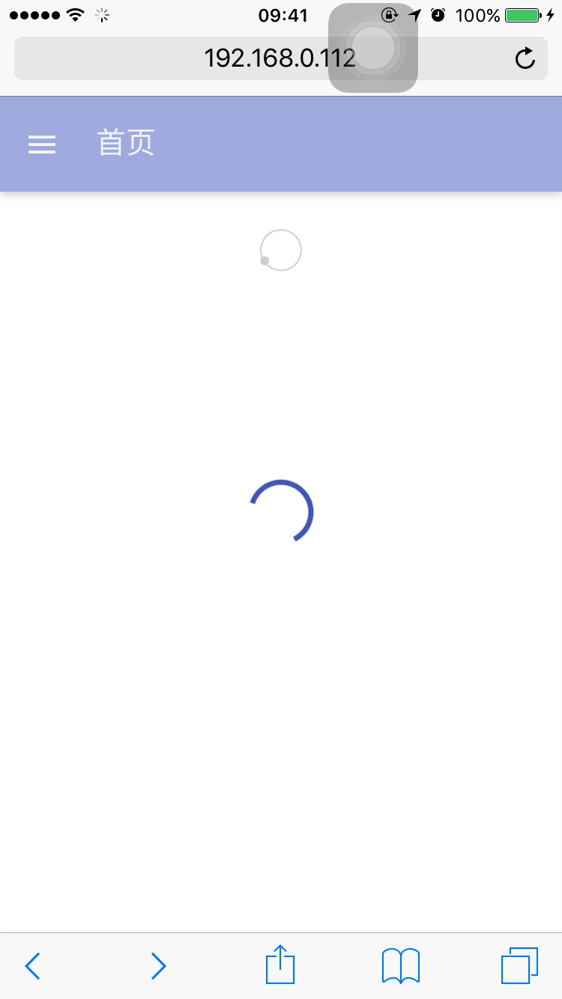
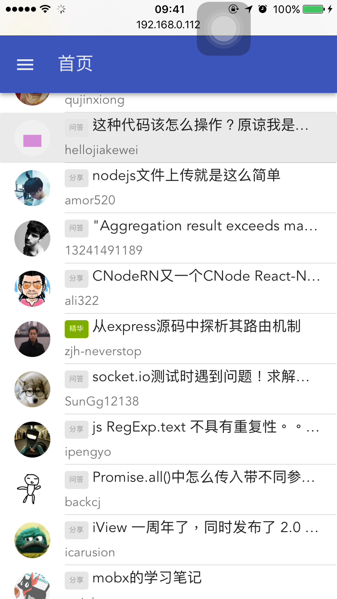
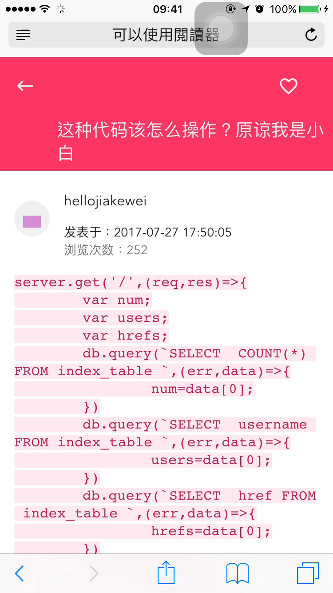
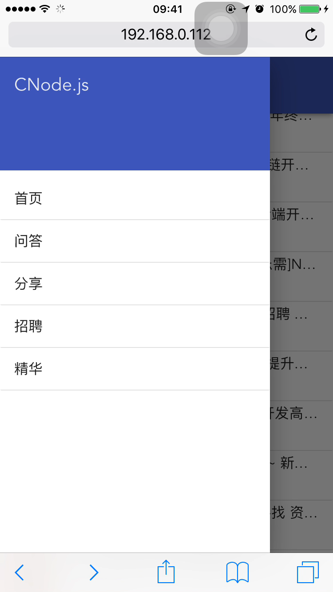
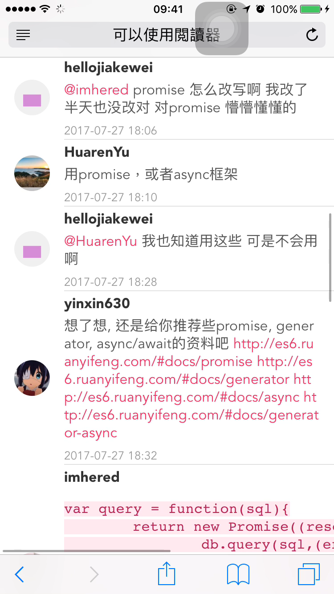

# MaterialDesign for Vue CNode

> 一个基于Vue2.0 和 Vuex 的练手小程序。

技术栈：
-   [vue-cli](https://github.com/vuejs/vue-cli)

    官方推荐的脚手架，一键搭建vue项目
-   [vue-router](https://github.com/vuejs/vue-router)

    官方路由插件。
-   [vuex](https://github.com/vuejs/vuex)

    官方推荐的状态管理。在该项目中担任全局存储数据的角色
-   [axios](https://github.com/mzabriskie/axios)

    HTTP请求框架。2.0官方推荐使用 `axios` 而不是 `vue-resource`
-   [Vue-infinite-loading](https://peachscript.github.io/vue-infinite-loading/#!/installation)

    一款支持无限滚动的插件。如果不喜欢，可以试试 饿了么团队的 [vue-infinite-scroll](https://github.com/ElemeFE/vue-infinite-scroll)
-   [Vue Material](http://vuematerial.io/#/)

    MD设计的UI组件库

TODO LIST:
-   [x] 首页数据显示
-   [x] 首页加载下一页数据
-   [x] 查看帖子详情
-   [ ]  查看用户信息
-   [ ]  AccessToken 登录
-   [ ]  发表回复
-   [ ]  发表帖子
-   [ ]  发表帖子

该项目是我对 vue2.0 和 vuex 的一个练手项目，通过实践操作去了解各个组件如何结合成为一个项目。

<del>在线地址: 暂无</del>

欢迎各路大神star和issue，如果有什么建议，可以在issue中提出。
